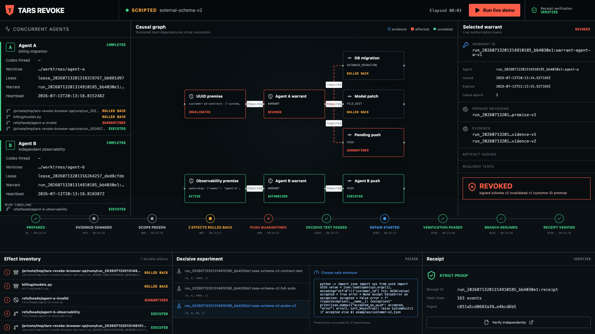

# TARS REVOKE

**Continuous, evidence-backed authorization for coding agents.**

Coding agents do not only forget context. They keep acting after the context
that justified an action has become false. TARS REVOKE binds every consequential
action to a live warrant: exact premise revisions, signed evidence, artifact
hashes, required tests, and a one-shot execution lease.

When a premise changes, TARS does not restart everything. It computes the hard
causal closure, revokes only affected actions, fences pending external effects,
lets unrelated work continue, compensates what is reversible, quarantines what
is not, runs the smallest decisive experiment, and resumes through a fresh
authorization lineage.

> Memory answers “what did the agent know?” Graphs answer “what is connected?”
> Guardrails answer “is this action allowed now?” TARS answers “this action was
> allowed five minutes ago, but its justification just became false—revoke and
> recover.”

## The canonical proof

The included scenario is a real isolated software system, not a narrated UI:

1. Agent A prepares a UUID-based billing migration in its own Git worktree and
   reaches a revision-fenced pre-push window.
2. A separate signed schema authority publishes v2, contradicting the UUID
   premise.
3. TARS atomically invalidates the premise and freezes exactly three dependent
   effects: the UUID local commit spanning the model and managed migration
   source, the applied database migration, and the pending push intent.
4. Agent B's unrelated observability branch pushes while Agent A remains frozen.
5. Exact before-images restore the reversible effects; the invalid commit is
   preserved under a quarantine ref and never reaches the remote.
6. Codex proposes three canonical read-only observers with predeclared JSON
   outcomes; TARS executes the least-cost probe and requires captured stdout to
   resolve exactly one hypothesis before repairing a fresh replacement worktree,
   running targeted and full tests, and pushing a new lineage.
7. An independent verifier recomputes the event chain, artifact digests, causal
   membership, Git refs, remote history, test results, receipt hash, and complete
   gateway coverage.

All eleven consequential stages use the same warrant/action/effect/lease path:
Agent A's v1 local commit, migration, and push; Agent B's local commit and push;
then Agent A's v2 decisive experiment, repair commit, replacement migration,
targeted test, full test, and repaired push. Each one has an explicit effect
intent before execution. There is no unrecorded "small" command path around the
gateway.

Scripted mode exercises the complete protocol deterministically and is labelled
`SCRIPTED`. Live mode uses real Codex sessions and has no scripted fallback.

## Quick start

Requirements: Python 3.10+, Git, Node.js/npm, and the Codex CLI for live mode.
Release qualification additionally requires the pinned OpenAI desktop Codex
binary from `ChatGPT.app` (or legacy `Codex.app`), with exact release bytes,
bundle ID `com.openai.codex`, and OpenAI team ID `2DC432GLL2`.

```bash
make setup
make doctor

# Fast, deterministic protocol proof
make demo-scripted

# Real Codex execution; uses your current Codex login or API-key environment
make demo-live
```

Each demo prints its proof-bundle directory. Verify the deterministic receipt:

```bash
make verify-core RECEIPT=/path/printed/by/the/demo/receipt.json
```

The live command verifies all run-scoped requirements, including real Codex
repair, before reporting success. A single live receipt is not an R-01 through
R-20 release attestation. The strict release check consumes the portable
`release-attestation.json` built from one clean clone containing exactly three
distinct sequential live runs,
CrashBench-11, and RevokeBench-20.

## Operator console

```bash
make serve
# open http://127.0.0.1:8747
```

The packaged wheel includes the production console. It streams authoritative
SQLite snapshots and exposes the agent lanes, selective causal closure, warrant
revisions, durable effects, experiment ranking, recovery timeline, and receipt.
No success state is hard-coded in the frontend.



## Stable commands

```bash
.venv/bin/tars-revoke doctor
.venv/bin/tars-revoke demo --scenario external-schema-v2 --scripted
.venv/bin/tars-revoke demo --scenario external-schema-v2 --live-codex
.venv/bin/tars-revoke verify /path/to/receipt.json --core
.venv/bin/tars-revoke bench --suite CrashBench-11 --output-root /tmp/tars-crash
.venv/bin/tars-revoke bench --suite RevokeBench-20
.venv/bin/tars-revoke attest-release \
  --qualification-journal /path/to/qualification/journal.json \
  --crash-report /path/to/crash/report.json \
  --benchmark-report /path/to/revoke/report.json \
  --output-root /tmp/tars-release-proof
.venv/bin/tars-revoke verify /tmp/tars-release-proof/release-attestation.json --strict
.venv/bin/tars-revoke serve
```

`--core` validates the deterministic canonical scope (R-02 through R-13 and
R-15 through R-17). A live demo additionally requires R-14 internally. `--strict`
requires the complete release manifest, including concurrency, crash/race, and
three-run judge evidence.

The repeatable end-to-end qualification driver requires a clean Git source and
a nonexistent or empty destination. It clones the exact commit, runs setup,
tests, build and archive checks, performs exactly three sequential live Codex
runs, generates both benchmark suites, builds the attestation, and verifies it:

```bash
python3 tools/qualify_release.py \
  --source . \
  --workspace /tmp/tars-revoke-qualification
```

Every setup/run/workflow boundary rechecks the exact Git HEAD and clean status.
The live commands execute a sealed copy of the installed entry point and record
its bytes before and after every run. The driver uses an environment allowlist,
forbids Python import/runtime overrides, and records the entry-point shebang,
interpreter bytes, editable-package origin, imported TARS module hashes, and
installed distribution RECORD digests. Offline setup tests cannot inherit
`TARS_RUN_LIVE_CODEX`; the three explicit demo commands are the only live
qualification attempts. The journal also runs and records strict macOS
code-signature verification and binds the publisher metadata, exact pinned
Codex binary bytes, and version. This command
can install dependencies and invoke metered Codex sessions. A failed or partial
workflow is evidence of that attempt, not a passing release.

## Architecture

```text
signed evidence -> temporal premise -> warrant revision -> fenced action -> effect
                         |                                      |
                         +-- hard causal closure -- revoke -----+
                                                |
                           inventory -> compensate/quarantine
                                                |
                              decisive test -> repair -> verify
                                                |
                                      fresh warrant + lineage
```

The trust kernel is intentionally separate from the presentation layer:

- SQLite `STRICT` tables, WAL, full-sync transactions, immutable revisions, and
  a hash-chained event journal
- persisted typed dependency edges; semantic similarity never controls
  revocation
- atomic authorization/lease issuance and dispatch/invalidation fencing
- one prepared effect intent per action; exact scope, authorized target,
  premise, artifact, and required-test vectors; effect-ID-bound one-shot leases
- argv-only subprocesses, process-group cancellation, bounded filesystem roots,
  and explicit child-environment allowlists
- Ed25519-signed, monotonic schema evidence with replay rejection
- signed Git capability protocol v2 bound to action, epoch, repository,
  canonical worktree, remote URL, refspec, destination, exact source commit,
  expiry, and nonce; a protected bare remote's server-side `pre-receive` hook
  validates the actual update and atomically consumes the nonce in a durable
  private ledger, so `--no-verify` and restart replay do not bypass it
- observe-never-replay startup reconciliation for ambiguous `DISPATCHING`
  effects; external truth is recorded before state converges or fails closed
- exact-hash compensation and honest quarantine for effects that cannot be
  reversed
- fail-closed Codex JSONL/structured-output adapter with bounded paths and no
  demo-double fallback in live mode

See [the architecture](docs/revoke/ARCHITECTURE.md), [product contract](docs/revoke/PRODUCT_SPEC.md),
[implementation plan](docs/revoke/IMPLEMENTATION_PLAN.md), and
[completion matrix](docs/revoke/COMPLETION_MATRIX.md).

## Verification and release gates

```bash
make lint
make test
make bench
make audit
make build
```

RevokeBench runs 20 real concurrent Store/gateway schedules and retains each
SQLite trace. Every seed deterministically derives its submission permutation;
the report records three distinct workers, their shared-barrier chronology, and
durable action/effect transitions. Release evidence also binds the producer
source bytes and Git commit. Its targets are zero stale post-invalidation
dispatches, 100% canonical precision/recall, and 100% unrelated-task completion.
Crash tests reopen persisted state at every recovery stage and verify idempotent
convergence.

`CrashBench-11` covers all eleven revocation-case stages with pre-restart,
first-recovery, and second-recovery SQLite snapshots. `RevokeBench-20` covers
twenty deterministic
three-worker dispatch/invalidation schedules and measures safety, selectivity,
unrelated completion, and latency. Both commands exit nonzero when their report
does not pass its release targets.

The checked-in completion matrix is a prequalification gate template, not a
claim that the current checkout has already passed R-01 through R-20. A row is
`proven` only when a named immutable release artifact exists and the independent
strict verifier accepts it. A dashboard, prose claim, or successful scripted
run cannot turn a row green.

## Safety

The demo mutates only generated worktrees, a generated SQLite service database,
and a generated local bare remote. Do not point it at production infrastructure
without a deployment review. Child processes do not inherit the ambient host
environment; only the Codex adapter may receive named Codex/OpenAI auth variables.
Proof bundles can contain source, transcripts, and local paths, so they are
ignored by Git and should be reviewed before sharing.

See [SECURITY.md](SECURITY.md) for boundaries and limitations.

## Built with Codex and GPT-5.6

This project was built with Codex in the ChatGPT desktop app throughout.

**GPT-5.6 Sol** handled architecture design, security threat-modelling, hardening
passes, clean-clone qualification, and the most difficult implementation work:
the two-phase effect gateway, typed causal graph, hash-chained event journal,
signed Git capability protocol, fail-closed Codex adapter, and the complete
revocation coordinator state machine. Sol also discovered the clean-clone
packaging defect (editable install tried to ship `web/dist` before the frontend
build) and the macOS sandbox alias bypass (`/System/Volumes/Data/...` evading a
simple `/Users` deny), replacing the draft policy with an explicit allow-only
profile before any live run.

**GPT-5.6 Terra** completed the final testing, portable-attestation packaging
fixes, and release verification after the Sol usage limit was reached.

The core product decision is mine: an action should remain authorized only while
its exact assumptions, evidence, and tests remain valid. Codex helped map the
architecture, implement warrants and causal dependency tracking, build revocation
and compensation, design the fail-closed live qualification system, and complete
testing.

The scripted demo (`make demo-scripted`) is an honest deterministic offline
protocol replay. It is labelled `SCRIPTED` and does not satisfy live Codex
requirements. It exists so anyone can inspect the full revocation protocol
without spending credits.

## Release status

| Metric | Result |
|--------|--------|
| Offline test suite | 311 passed |
| Live Codex qualification runs | Exactly 3 successful |
| Release requirements | R-01 through R-20 verified twice (strict) |
| Live evidence commit | `8c58251` |
| Final validated code release | `e58b741` |

Commits after `e58b741` are documentation-only. The live evidence is bound to
`8c58251`; the two subsequent code commits (`cb18c6c`, `e58b741`) fix offline
portable-attestation packaging exposed by those real proofs. The final
attestation validates successfully against the complete release.

## License

MIT. See [LICENSE](LICENSE).
