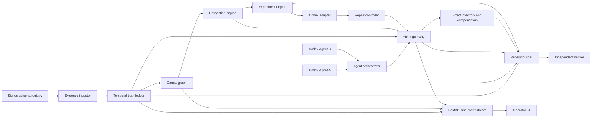

# TARS REVOKE architecture

## System flow



## Layers

| Layer | Responsibility | Forbidden responsibility |
|---|---|---|
| Domain | Immutable contracts, enums, state transitions, validation | I/O, subprocesses, SQL |
| Persistence | SQLite transactions, hash-chained journal, outbox, artifact references | Semantic decisions, shell execution |
| Services | Evidence, warrant, graph, revocation, compensation, experiments, repair, receipts | Framework request handling |
| Adapters | Codex, Git, process, SQLite migration, HTTP evidence source | Authorization decisions |
| Orchestration | Concurrent agents, checkpoints, case progression, restart reconciliation | Rewriting historical records |
| API/UI | Validated commands, snapshots, event streaming, visualization | Authoritative truth or enforcement |

## Authoritative data model

SQLite runs in WAL mode with foreign keys, busy timeout, explicit `BEGIN IMMEDIATE` transactions, and an outbox committed with state changes. Raw artifacts are content-addressed by SHA-256 under the run proof directory.

Required tables:

- `runs`, `agents`, `agent_sessions`
- `evidence_sources`, `evidence_records`, `premises`, `premise_evidence`
- `graph_nodes`, `dependency_edges`
- `warrants`, `warrant_premises`, `action_intents`, `effects`
- `execution_leases`, `dispatch_reconciliations`
- `revocation_cases`, `revocation_members`
- `experiment_candidates`, `experiment_runs`, `test_runs`
- `events`, `outbox`, `receipts`

### EvidenceRecord

Immutable observation with source identity, URI, source version, observed time, validity time, digest, signature status, verification status, raw artifact reference, and normalized premise proposals.

### Premise

Immutable revision with scope, subject, relation, value, `single|set|temporal` semantics, status, `valid_at`, `invalid_at`, evidence links, and invalidator. Invalidated IDs are terminal; corrected knowledge receives a new ID.

### DependencyEdge

Typed `requires|supports|produced_by|materializes|replaces|verifies` edge with `hard|soft` strength, scope, declarer, confidence, and creation time. Only scoped hard `requires` reachability propagates automatic revocation.

### Warrant

Authorization record with one causal scope, an explicit authorized-target set,
exact premise revisions, required artifact hashes, required tests, risk, state,
revision epoch, issue/expiry times, and revocation cause. A warrant is not a
model explanation; it is evaluated deterministically.

### ActionIntent

Declared action with agent, action type, scope, target, payload digest, exact
premise revision vector, exact artifact vector, risk, reversibility, state,
`not_before`, execution lease reference, and idempotency key. Its scope must
match the warrant and its target must be a member of the warrant's authorized
target set.

### EffectRecord

Prepared intent and later observed durable mutation with action, scope, target,
type, before/after hashes, forward/reverse artifact references, reversibility,
compensation handler, state, and timestamps. Authorization requires exactly one
prepared effect for the action, with matching scope, target, type, and
reversibility.

### ExecutionLease

Short-lived one-shot capability bound to exactly one run, action ID, effect ID,
warrant ID, warrant epoch, token digest, and idempotency key. Consumption is
transactional with the action/effect transition to `DISPATCHING`; a lease cannot
be reused for a sibling effect.

### DispatchReconciliationRecord

Immutable startup observation for a persisted `DISPATCHING` action/effect pair.
It records the adapter, expected external state, observed external state, and
one of `APPLIED`, `NOT_APPLIED`, `CONFLICT`, or `UNKNOWN`. Reconciliation is
idempotent and never performs the external effect again.

### Receipt

Canonical JSON derived only from durable normalized records. Its digest covers the complete causal sequence and artifact manifest.

## State machines

Premise:

```text
PROPOSED -> ACTIVE
ACTIVE -> DISPUTED | INVALIDATED | SUPERSEDED
DISPUTED -> ACTIVE | INVALIDATED
INVALIDATED is terminal
```

Warrant/action/effect:

```text
DECLARED -> PREPARED -> AUTHORIZED -> DISPATCHING -> EXECUTED
PREPARED/AUTHORIZED -> REVOKE_PENDING -> REVOKED
REVOKED + reversible -> ROLLED_BACK
REVOKED + irreversible + not dispatched -> QUARANTINED
REVOKED + irreversible + dispatched -> CONTAINMENT_REQUIRED
```

Revocation case:

```text
OPEN -> FROZEN -> INVENTORIED -> COMPENSATING -> EXPERIMENTING
     -> REPAIRING -> VERIFYING -> RESUMED -> ATTESTED -> CLOSED
```

Any case stage can become `ESCALATED`; failure still produces a receipt.

## Authorization and linearization

Every consequential operation passes through `EffectGateway.authorize`. It
requires one explicitly selected prepared effect and validates the action,
effect, and warrant as a single vector: causal scope, authorized target, action
and effect type, reversibility, exact premise revisions, artifact hashes,
required tests, epoch, and expiry. It then issues an effect-ID-bound one-shot
lease.

Immediately before an external effect, `EffectGateway.dispatch` recomputes the
caller-supplied artifact and test vector, then opens one transaction and:

1. Reloads the action, selected effect, effect-bound lease, and warrant.
2. Confirms all exact premise revisions remain active.
3. Confirms scope, authorized target, premise, artifact, and required-test
   vectors still match.
4. Confirms the lease token, effect ID, epoch, expiry, and idempotency key.
5. Consumes the lease, moves both action and effect from `AUTHORIZED` to
   `DISPATCHING`, and commits the outbox record in one transaction.

The filesystem itself cannot join a SQLite transaction, so effect adapters also
bind the exact input at their irreversible boundary. Git uses signed capability
protocol `tars.git-push/v2`, bound to action, epoch, repository, canonical
worktree, remote URL, refspec, destination, source object ID, issue/expiry time,
and nonce. The client `pre-push` hook is a fast local check; the authoritative
protected bare remote `pre-receive` hook compares the capability with Git's
actual update and atomically consumes the nonce in a private durable SQLite
ledger. Therefore `git push --no-verify` cannot skip authorization, and a
consumed token remains rejected after a gateway restart.

Evidence invalidation uses `BEGIN IMMEDIATE`, terminally invalidates the premise revision, increments affected warrant epochs, records the hard-dependency closure, and changes eligible actions to `REVOKE_PENDING` in the same transaction.

This produces the linearization rule: if invalidation commits first, dispatch cannot pass its revision check. If dispatch commits first, the system truthfully enters containment rather than claiming an impossible undo.

The canonical scenario exercises this boundary for all eleven consequential
stages:

1. Agent A v1 local commit, migration, and pending push.
2. Agent B unrelated local commit and push.
3. Agent A v2 decisive experiment, repair local commit, replacement migration,
   targeted test, full test, and repaired push.

The receipt's independent verifier compares this expected stage inventory with
the complete durable warrant/action/effect/lease inventory. An omitted or
invented stage, mismatched vector, unbound experiment/test record, or invalid
authorize-before-dispatch-before-execute sequence fails verification.

## Selective revocation algorithm

1. Start at the invalidated premise node and scope.
2. Traverse outgoing persisted hard `requires` edges only.
3. Materialize the closure and complete dependency paths in `revocation_members`.
4. Increment epochs and freeze only actions/effects in the closure.
5. Signal in-flight managed processes through the process registry.
6. Reconcile worktrees and external adapters into the effect inventory.
7. Leave all negative-reachability actions untouched and record that proof.

No semantic similarity or model call participates in enforcement-time reachability.

## Effect handling

- File edit: before/after Git blob hashes plus forward/reverse patch; reversible when the current hash still equals the recorded after-hash.
- Local commit: preserved on a quarantine ref; rollback uses a new revert/replacement lineage or disposal of an isolated worktree, never silent history rewriting.
- Command: argv, cwd, environment digest, process group, outputs, exit status, and declared compensator. Shell strings are rejected.
- Database migration: isolated database before-image or verified down migration; hash mismatch escalates.
- Push: irreversible action with an effect-bound preflight lease and a signed
  v2 Git capability. The protected remote rejects missing, mismatched, expired,
  or replayed capabilities in `pre-receive`, including pushes that skip the
  client hook. Already-visible pushes become containment-required.

## Experiment selection

Codex proposes at least three typed candidates, each with hypotheses, one or more predicted outcomes, argv command, fixture references, touched files, risk, and runtime estimate. Deterministic validators reject unsafe, non-discriminating, or out-of-scope candidates.

Among accepted candidates that predict different outcomes for at least two live hypotheses, select the minimum tuple:

```text
(risk_rank, touched_files, estimated_runtime_ms, command_count)
```

The claim is bounded minimality within the recorded safe candidate set, not global mathematical minimality.

## Codex integration

The adapter discovers a working executable in this order: explicit `TARS_CODEX_BIN`, official app bundles, then `PATH`, verifying each with `--version`. It uses non-interactive JSONL output, explicit CWD and sandbox, no shell, and captures thread/turn/item events.

- Experiment proposal: read-only sandbox plus strict JSON Schema.
- Experiment execution: gateway-managed argv, not Codex authority.
- Repair: workspace-write sandbox restricted to Agent A's managed worktree.
- Verification: gateway-managed targeted and full commands.
- Resume: new action IDs and warrants only after tests pass.

`TARS_CODEX_MODEL` is configurable. Model rejection, auth failure, timeout, invalid structured output, and repair failure are first-class persisted outcomes; no scripted response silently replaces Codex.

The R-20 qualification path is narrower than ordinary adapter discovery. It
requires the OpenAI desktop bundle (`ChatGPT.app`, or legacy `Codex.app`),
runs deep strict macOS `codesign` verification, and binds bundle ID
`com.openai.codex`, OpenAI team ID `2DC432GLL2`, exact pinned executable bytes,
version output, and the strict-verification result. If the vendor bundle fails
strict local verification, the release receipt discloses that limitation rather
than turning the recorded publisher metadata into a false success claim. It
rechecks the exact Git
commit and clean status around every setup, live, benchmark, attestation, and
verification command. The exactly three live commands use a sealed entry-point
copy whose bytes are captured before and after each invocation; setup tests run
with inherited live-test activation removed.

## Canonical fixture isolation

- Two distinct Git worktrees and two distinct Codex sessions.
- Managed Codex sessions receive no Git capability token; authorized pushes are
  issued by the gateway, while the local bare remote independently enforces the
  signed capability at `pre-receive`.
- Separate HTTP schema registry owns signed versioned artifacts outside worker roots.
- Agent A's old push uses a three-second preflight window.
- Agent B's unrelated push must land between Agent A `FROZEN` and `RESUMED` events.
- Invalid work remains on a quarantine ref.
- Replacement work uses new IDs and a new remote commit.

## Restart recovery

On startup, the coordinator:

1. Verifies the event hash chain and schema version.
2. Builds the durable recovery snapshot before starting a new scenario.
3. Observes every unresolved `DISPATCHING` action/effect against adapter reality
   without replaying it.
4. For Git pushes, compares the expected destination and source OID with the
   protected remote: `APPLIED` completes the action/effect, `NOT_APPLIED` marks
   them failed, and `CONFLICT` or `UNKNOWN` moves both to
   `CONTAINMENT_REQUIRED`.
5. Records the immutable reconciliation and event-journal entry atomically.
6. Replays pending outbox events and resumes compensation idempotently.
7. Rebuilds any missing receipt from normalized state.

Repeated startup observes the recorded reconciliation and creates no duplicate
record or event. Non-Git ambiguous dispatches fail closed because the
coordinator has no safe external-truth observer for them. This policy is
observe-never-replay: recovery never repeats an irreversible command to infer
whether its first execution happened.

## Security posture

- No secrets are accepted in action payloads or receipts.
- Structured redaction is applied before logs leave the process.
- Commands are argv arrays; shell interpretation is disabled.
- Paths must resolve under registered run/worktree/artifact roots.
- Evidence sources are pinned and signatures verified.
- Every consequential action has a matching prepared effect and an
  effect-ID-bound one-shot lease over exact scope, target, premise, artifact,
  and test vectors.
- Git pushes require server-validated signed v2 capabilities with durable
  one-use nonces; the client hook is supplementary, not the trust boundary.
- Agent processes receive no remote Git credentials.
- API input is validated, state transitions are centralized, and errors are structured and observable.

The protected bare remote is still a local proof boundary. A host administrator
can alter its hook, secret, ledger, database, or process; production hosting
needs equivalent protected server-side enforcement and a deployment-specific
reconciliation adapter.
